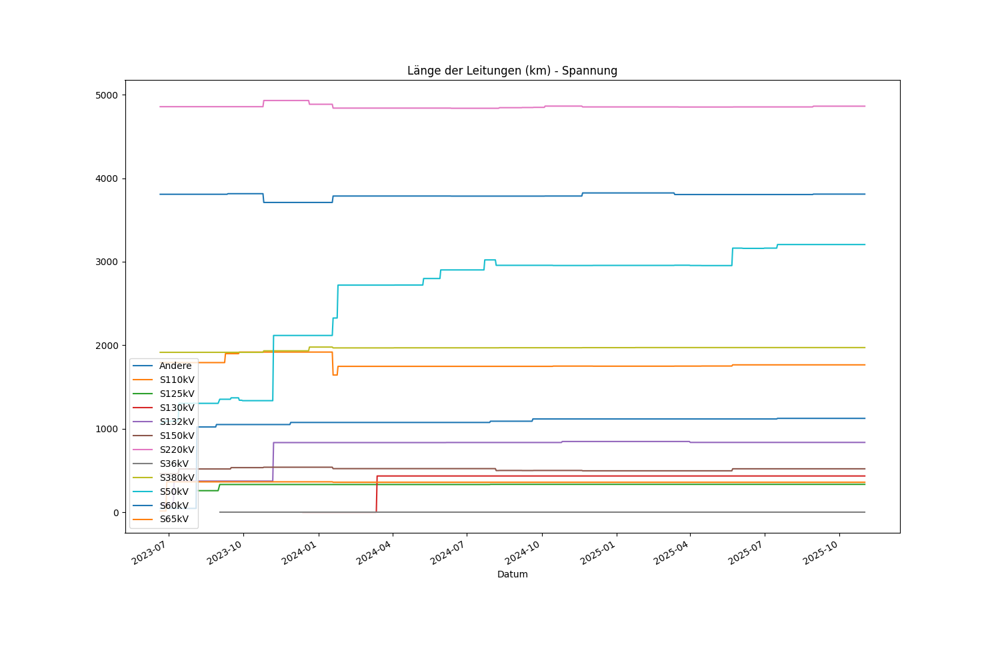
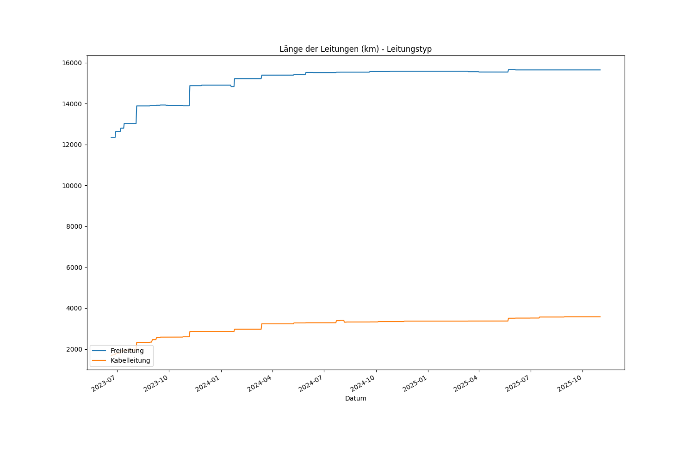
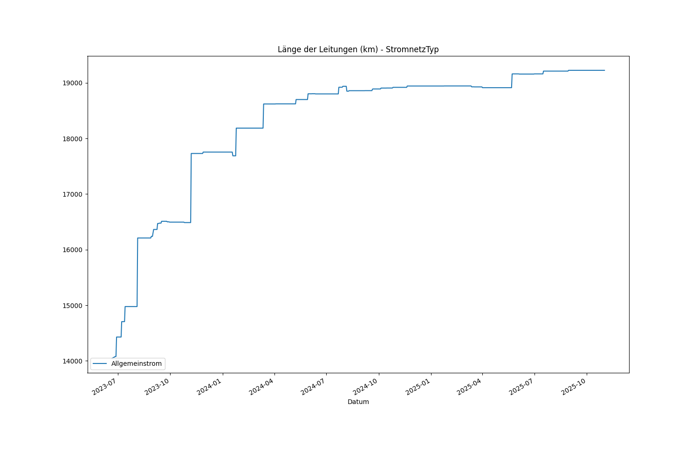
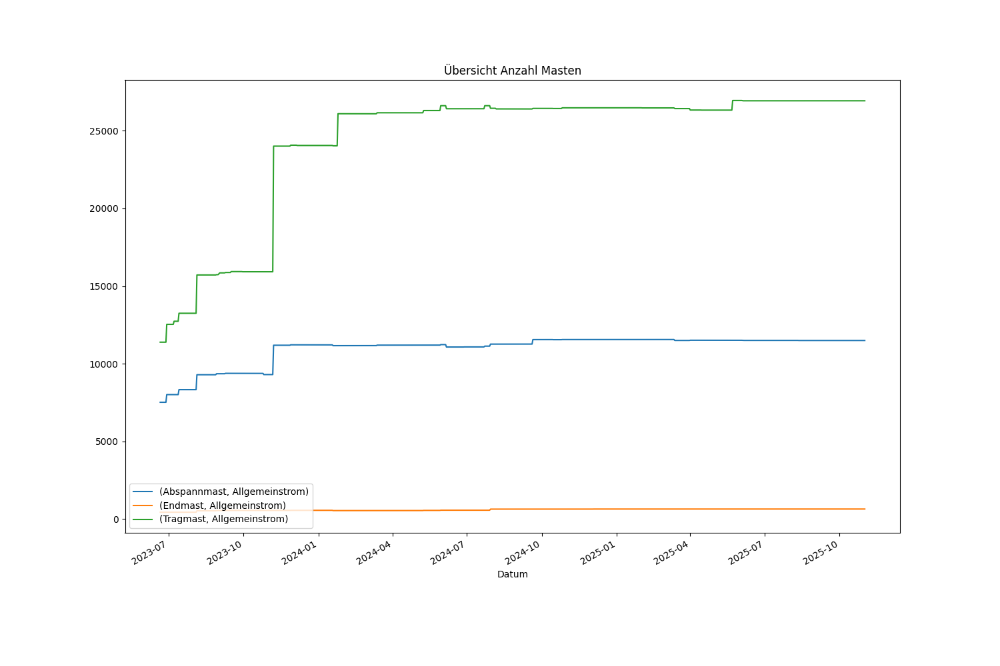
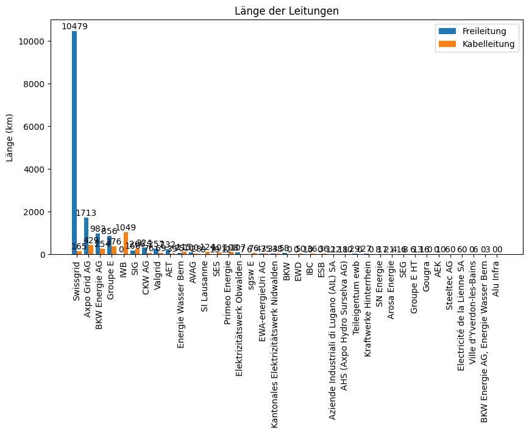
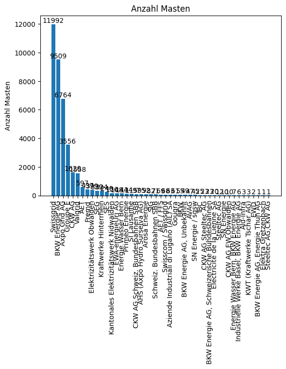

# Kennzahlen Elektrische Anlagen >36 kV
Auf dieser Seite werden die wichtigsten Kennzahlen der Geobasisdaten "Elekrische Anlagen mit einer Nennspannung von über 36 kV" dargestellt.
Die Kennzahlen werden täglich abgeleitet.

## Kennzahlen nationale Übersicht - Leitungen

## Kennzahlen nationale Übersicht - Stationen

## Kennzahlen nationale Übersicht - Masten

## Kennzahlen pro Werkbetreiber

